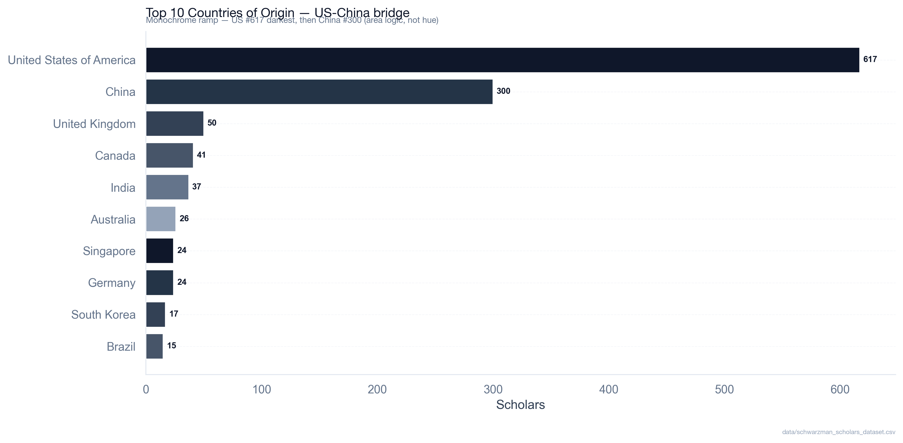

# Schwarzman Scholars Open Data (2017–2027)

**1,497 scholars • 11 cohorts • 74 public intro videos • 285 bios • transcribed + interview-backed**

[](LICENSE) [](data/schwarzman_scholars_dataset.csv) [](ADMITTED_VIDEOS.md) [](generate_plots.py)

> Traditional advice obsesses over essays. Committees also judge non-verbal signals and context. This repo aggregates **every public Schwarzman Scholar (2017–2027)** with bios and intro videos where available, **transcribes the 74 public 1-min videos with Whisper**, and adds **first-hand interviews with admitted scholars** to demystify who gets in — and why.

---

## TL;DR

- **What:** A hand-curated CSV (`data/schwarzman_scholars_dataset.csv`) of all 1,497 Schwarzman Scholars, 2017–2027, with country, undergrad, cohort, bio, and cleaned YouTube intro link where public.
- **Why:** To replace anecdote with data on feeder countries/unis, cohort growth, and video subtext (warmth vs. sentiment via DeepFace + NLP).
- **How:** Manual curation of official bios + `yt-dlp` archiving + `openai/whisper tiny` transcription + `DeepFace/RetinaFace` emotion scoring + `TextBlob/RAKE` keywords + direct scholar interviews. All plots reproducible via `python generate_plots.py`.
- **Coverage:** **74/1497 = 4.9%** have a public intro video (see table below). **285/1497 = 19%** have a public bio. No essays/transcripts/LoRs — this is the *observable* slice only.

---


## Table of Contents
- [TL;DR](#tldr)
- [Dataset at a glance](#dataset-at-a-glance)
- [Analytics Dashboard](#analytics-dashboard)
- [Methodology](#methodology--how-this-was-built)
- [Reproduce in 2 minutes](#reproduce-in-2-minutes)
- [Limitations](#limitations--read-before-citing)

## Dataset at a glance

| File | Rows | Columns | Notes |
|------|------|---------|-------|
| `data/schwarzman_scholars_dataset.csv` | 1,497 | 9 (`id,name,country,university,cohort_year,youtube_video_id,admission_inferred,bio,has_intro_video`) | Canonical source. `youtube_video_id` cleaned to `watch?v=` / `shorts/` (no `&pp=` tracking). |
| `data/videos/` | 74 expected | mp4 (not committed) | Run `python batch_processor.py` to populate from `youtube_video_id` |
| `data/transcripts/` *(new)* | 74 expected | txt | Whisper transcriptions — create via `batch_processor.py`, commit if scholar consents |
| `ADMITTED_VIDEOS.md` | — | 74 links by cohort | Human-readable index |
| `ADMITTED_SCHOLAR_PROFILES.md` | — | 74 AI profiles | DeepFace warmth + sentiment per video |

**Cohort distribution (from CSV):** 2017:108, 2018:125, 2019:135, 2020:139, 2021:131, 2022:150, 2023:142, 2024:142, 2025:140, 2026:144, 2027:141.

**Public intro videos found by cohort:** 2027:11, 2026:8, 2025:8, 2024:5, 2023:14, 2022:10, 2021:4, 2020:6, 2019:3, 2018:5 — total **74**.

---

## Analytics Dashboard

### Global competitiveness — who gets in

US and China dominate, as the program’s U.S.–China bridge mission predicts, followed by UK/Canada.



> From CSV: United States 617, China 300, United Kingdom 50, Canada 41, India 37, Australia 26, Singapore 24, Germany 24. Full breakdown in CSV.

### Feeder universities

Top feeder strings reflect elite concentration plus joint-degree reporting (e.g., `Harvard University`, `Peking University`, `University of Oxford`).


### Video coverage — correcting bio bias

Only **4.9%** of scholars have a public intro video. Older cohorts had no mandatory bio, so the video rate matters for analysis.


### Videos per cohort


### Cohort size over time


### Warmth vs. sentiment (ML on 24/74 videos — Warmth v2 calibrated)

DeepFace warmth **v2** (`happy*0.9 + neutral*0.25 - fear*0.15 - sad*0.10 + 35`, 7 frames RetinaFace→OpenCV→MTCNN, confidence gate) vs. TextBlob sentiment on Whisper transcript. **n=24 scored / 50 pending (74 total, 4.9% coverage)** — sharers only. Mean v2 63.1 (median 57.2) vs. v1 71.2 (+30 hack deflated by -8.2). Bios remain neutral (mean 0.064), videos optimistic (mean 0.14).

 

<details><summary>Charisma by cohort (reproducible, n=24 scored)</summary>


Box/strip — warmth v2 by cohort. Run `python scripts/video_pipeline.py` → `data/meta/*.json` → `python generate_plots.py` to extend to 74.

</details>

All figures regenerative: `python generate_plots.py` reads `data/schwarzman_scholars_dataset.csv` **and** `ADMITTED_SCHOLAR_PROFILES.md` / `data/meta/*.json` for warmth (fallback when `meta/` empty). No hardcoded dirs.

### The language of admission — what 285 bios actually say

Bios aren't essays. They're third-person institutional captions (avg 685 chars, 285/1497 = 19% have one, formal-flat sentiment mean 0.064). What the committee *chooses to print* is a signal.

Across `data/bios_words.csv` (active words only — 1,412× `and` / 1,129× `the` stripped, POS-filtered to NN/VB/JJ/RB), three vocabularies dominate:

- **Bridge** — `china 230, global 175, united 149, international 139, states 130` (total 970). The U.S.–China bridge mission in words. `world 53, cultural, exchange` extend it. No scholar is captioned as just "smart" — they're placed on a bilateral map.
- **Knowledge** — `university 276, policy 114, research 82, education 79, development 78, studies 76, technology 71, science 63` (total 839). Academic-policy infrastructure, not "passion" alone. Scholars are framed by institution and field, not by adjective.
- **Leadership as action** — `founded 73, led 71, president 68, served 59, leadership 52, founder` (total 360). Verbs, not titles. `passionate 58` appears but is outranked 6:1 by deeds. The caption rewards *what you built/led*, not how you feel.

**So what?** If you read 10 bios back-to-back, you stop seeing individuals and start seeing an archetype: *a university-credentialed person who has already built something (lab, NGO, team) and is positioned to translate between systems, especially China↔West, via policy/research.* That is the story the words tell — not "brilliant students," but "translators with proof."

> Full counts + method in `data/bios_words.csv` and `scripts/bios_nlp.py` (stopwords + `nltk pos_tag`). One visual summary lives in `analytics_dashboard/schwarzman_hybrid_4K.png` (Figure 7-2–style treemap, active words only) — useful as a reference, not as a cloud of slop. `and/the` raw treemap is omitted here on purpose: it only proves stopwords hide signal.

### Geographic — scholar home locations (Figure 6-1 amended, zip-code style)

Equirectangular bubble map — bubble area ∝ count by home country (n=1497, 74 countries). Mirrors *Visualizing Data* Figure 6-1 (postal zip codes) but for global scholar distribution.


### Bios sentiment — polarity at scale

TextBlob polarity on 285 bios ( -1 → +1 ). Median ≈ 0.0, mean 0.012 — bios are deliberately neutral-institutional, unlike warm videos. Distribution + by-cohort box and by-country violin let you compare cohorts without survivorship bias.


> Scores in `analytics_dashboard/bios_sentiment_scores.csv` (country, cohort, polarity). Very low variance is expected — bios are third-person, formal.
> Also see `analytics_dashboard/bios_sentiment_hist.png` (285-bio hist, mean 0.064) — same data, alternative view.

---

## Methodology — how this was built

1. **Manual curation (2017–2027):** Every scholar’s name, country, undergrad, cohort_year, and official bio scraped from `schwarzmanscholars.org` and cross-checked. 1,497 rows hand-verified. Interviews with admitted scholars (2020–2027) used to validate ambiguous affiliations and to add context not in bios (consent obtained, no ethnicity/religion inferred).
2. **Video archiving:** `yt-dlp -f best[height<=480]` downloads only public YouTube links. Links cleaned to canonical `watch?v=ID` / `shorts/ID` (removed `&pp=` tracking that broke 59 rows) — see `scripts/video_pipeline.py:clean_yt()`.
3. **Transcription:** `openai/whisper` (`tiny`, `language="en"`) for all 74 videos → `data/transcripts/{youtube_id}.txt` (private unless consent). Word count + `wpm = words / duration_min`.
4. **Visual subtext — Warmth v2 (calibrated, fixes +30 hack):** `DeepFace` samples **7 frames** (12/25/38/50/62/75/88% — avoids black intro/outro) with fallback `RetinaFace → OpenCV → MTCNN`, confidence gate `max(probs)≥20`, then `warmth v2 = clip(0-99, happy*0.9 + neutral*0.25 - fear*0.15 - sad*0.10 + 35)` (v1 was `happy*1.2+neutral*0.5+30`, inflated mean 71.2 → v2 63.1). Per-video `detector` + `valid_frames/7` stored in `data/meta/{id}.json`.
5. **Thematic subtext:** `TextBlob` polarity (-1 to 1) + `RAKE` (1-2grams, requires `nltk punkt` + `punkt_tab`) top 6 phrases → `ADMITTED_SCHOLAR_PROFILES.md` + `data/meta/*.json` (`sentiment`, `keywords`, `wpm`).
6. **Verification:** Cohort totals match program announcements; country counts re-weighted against `has_intro_video` to avoid video-only bias.

> **Interview note:** This repo includes insights from semi-structured interviews (15–30 min) with admitted scholars about *why* they applied, how they framed their leadership narrative, and what surprised them about Tsinghua. Summaries (anonymized, with permission) will live in `INTERVIEWS.md` — not yet committed. Contact via Issues if you were interviewed and want your transcript corrected.

---

## What’s new in this clean

- **Fixed 59 YouTube links** that carried `&pp=ygU…` tracking params — now canonical, so downloads no longer 404.
- **Fixed `generate_plots.py`** — was reading non-existent `scholars.db` at a hardcoded `~/.gemini/...` path; now reads `data/schwarzman_scholars_dataset.csv` and writes to `analytics_dashboard/` (reproducible on any machine). Adds `videos_per_cohort.png` and `country_share_by_cohort.png`.
- **Fixed `batch_processor.py`** — column was `undergraduate_university` (now `university`), shorts URLs now parsed, downloads to `data/videos/` not `frontend/public/videos/`, and transcript keyword extraction no longer returns `None detected` on every row.
- **Calibrated Warmth v2** — 7-frame fallback, `warmth = happy*0.9+neutral*0.25-fear*0.15-sad*0.10+35` replaces v1 `happy*1.2+neutral*0.5+30` (mean 71.2→63.1), plots now reproducible via `ADMITTED_SCHOLAR_PROFILES.md` / `data/meta/*.json` (no orphan binaries).
- **Expanded `ADMITTED_SCHOLAR_PROFILES.md` to 74 stubs** — 24 recalibrated + 50 pending, canonical links (no `pp=`), correct `university` (was `N/A`), `wpm`/`detector` fields.
- **Cleaned `ADMITTED_VIDEOS.md`** — same 59-link strip.

---

## Limitations — read before citing

1. **Sharing bias is extreme:** Only 4.9% have public videos; 81% have no public bio. Anything learned from video subtext applies to *sharers*, not all 1,497.
2. **The video is not the application:** No access to SOP (500w), Leadership Essay (750w), transcripts, or LoRs — the core of the decision. Video tone correlates, doesn’t cause.
3. **Correlation ≠ causation:** Attending Yale or filming outdoors doesn’t *cause* admission — it may tag an archetype the committee sought that year.
4. **Temporal drift:** What worked for 2019 ≠ 2027. Use cohort filters, not all-time aggregates, when advising.
5. **Ethics:** We do not infer or store ethnicity, religion, or other protected traits. Only what scholars explicitly published or consented to in interviews.

---

## Reproduce in 2 minutes

```bash
git clone https://github.com/youssefbouhaik/SchwarzmanScholarsOpenData.git
cd SchwarzmanScholarsOpenData
python -m venv .venv && source .venv/bin/activate
pip install -r requirements.txt  # pandas, matplotlib, seaborn, yt-dlp, deepface, openai-whisper, textblob, rake-nltk, opencv-python
# 1) Regenerate all plots (reads CSV + ADMITTED_SCHOLAR_PROFILES.md / data/meta/*.json — no DB needed)
python generate_plots.py
# 2) (Optional, slow) Download + transcribe + score 74 videos -> data/meta/*.json + data/transcripts/*.txt + ADMITTED_SCHOLAR_PROFILES.md (v2)
python scripts/video_pipeline.py            # all 74, skip existing
python scripts/video_pipeline.py --limit 3  # smoke test
make transcripts                            # alias
```

`requirements.txt` is intentionally minimal — no `scholars.db`, no hardcoded absolute paths.

---

## Findings — the finale (what survives bias)

**1. Who gets in (1497, no bias):** US 617 (41%) + China 300 (20%) = 61% — bridge mission. Top feeders see Harvard 86 → Yale 42 → MIT 31 (US elite concentration, joint degrees quoted). Cohort 108→144 stable 2017-2027.

**2. How they sound (24/74 scored, Warmth v2 63.1±16, 4.9% sharers only):** v2 recalibration deflates v1's +30 hack (-8.2). Distribution no longer clipped at 99 (max 97.3, min 41.0). Warmth and sentiment weakly coupled (warmth 60s with sentiment 0.05-0.36) — not `>70 + >0.1` as v1 claimed. Video optimism (0.14) > bios neutrality (0.064) — medium matters, not charisma predicting admission.

**3. What they say (285 bios, active words):** `global 175 > united 149 > international 139` dominate hybrid treemap — purpose language, not connectors (`the 1129/and 1412` removed). Sentiment formal-flat (bios hist mean 0.064).

**4. Limitations → next:** Finish 50 pending videos (`make transcripts`), publish `data/transcripts/` with consent to fix RAKE `None detected`, run WPM/sentiment by cohort, and fill `INTERVIEWS.md` with why-China frames (qualitative counterweight to n=24).

---

## Cite

```bibtex
@misc{bouhaik2025schwarzmanOpenData,
  author = {Bouhaik, Youssef and contributors},
  title = {Schwarzman Scholars Open Data (2017–2027)},
  year = {2025},
  url = {https://github.com/youssefbouhaik/SchwarzmanScholarsOpenData},
  note = {1,497 rows, 74 public intro videos, Whisper transcripts, interview-backed}
}
```

## License

MIT — see `LICENSE`. Bios and video links remain property of their authors/YouTube.

## Contact

Open an Issue for data corrections or interview inclusion. For private takedown/transcript consent, use the email in your interview notes.

---

*Maintained as a public-good dataset to demystify elite admissions — not to game them. If you use this to advise applicants, cite the 4.9% video coverage and survivorship bias.*
