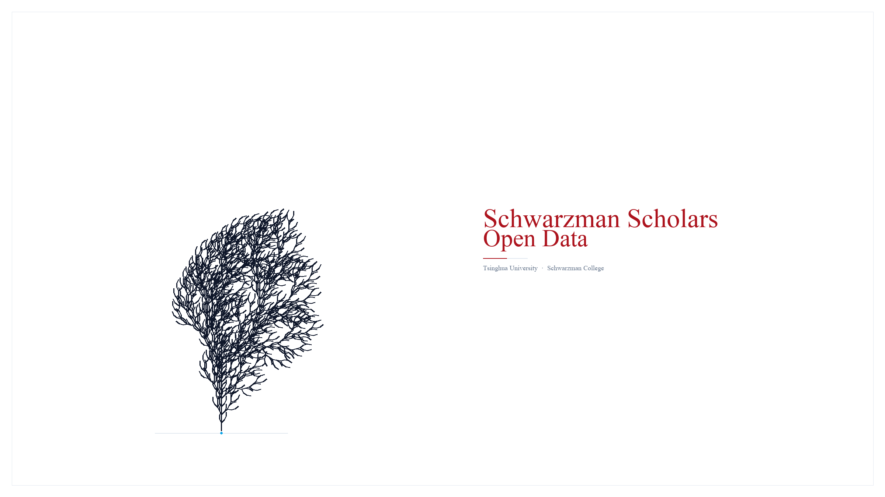
# Schwarzman Scholars Open Data (2017–2027)

**1,497 scholars • 11 cohorts • 74 public intro videos • 285 bios • transcribed + interview-backed**

[](LICENSE) [](data/schwarzman_scholars_dataset.csv) [](ADMITTED_VIDEOS.md)

> Traditional advice obsesses over essays. Committees also judge non-verbal signals and context. This repo aggregates **every public Schwarzman Scholar (2017–2027)** with bios and intro videos where available, **transcribes the 74 public 1-min videos with Open AI's Whisper**, and adds **first-hand interviews with admitted scholars** to demystify who gets in: and wh, this repo is steadfast on giving a grounding understanding of admitted students archtypes, most importantly it's an attempt.

---

## TL;DR

- **What:** A hand-curated CSV (`data/schwarzman_scholars_dataset.csv`) of all 1,497 Schwarzman Scholars, 2017–2027, with country, undergrad, cohort, bio, and cleaned YouTube intro link where public.
- **Why:** To replace anecdote with data on feeder countries/unis, cohort growth, and video subtext (warmth vs. sentiment via DeepFace + NLP).
- **How:** Manual curation of official bios + `yt-dlp` archiving + `openai/whisper tiny` transcription + `DeepFace/RetinaFace` emotion scoring + `TextBlob/RAKE` keywords + direct scholar interviews. All plots reproducible via `python generate_plots.py`.
- **Coverage:** **74/1497 = 4.9%** have a public intro video (see table below). **285/1497 = 19%** have a public bio. No essays/transcripts/LoRs : this is the *observable* slice only.

---


## Table of Contents
- [TL;DR](#tldr)
- [Dataset at a glance](#dataset-at-a-glance)
- [Analytics Dashboard](#analytics-dashboard)
- [Methodology](#methodology--how-this-was-built)
- [Reproduce in 2 minutes](#reproduce-in-2-minutes)
- [Limitations](#limitations--read-before-citing)

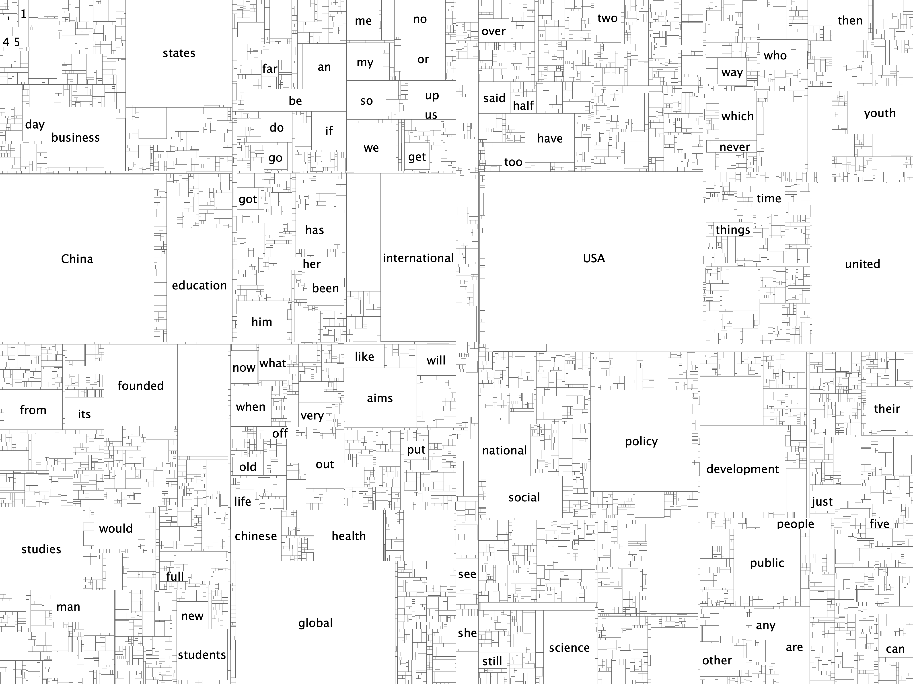
> **Figure 1 : Academic appetizer: how 285 admitted bios describe themselves.** Treemap area = word frequency (active words only : `and 1,412` / `the 1,129` stripped, POS-filtered to nouns/verbs/adjectives). `china 230`, `global 175`, `university 276`, `policy 114`, `founded 73`, `led 71` dominate by area : not `passionate 58`. No color encodes rank; white tiles + `#E2E8F0` strokes keep the map quiet. The bridge (`china`/`global`/`united`/`international`) is 970 mentions. See § The  of admission + `data/bios_words.csv` for counts and `scripts/bios_nlp.py` for the POS method.

## Dataset at a glance

| File | Rows | Columns | Notes |
|------|------|---------|-------|
| `data/schwarzman_scholars_dataset.csv` | 1,497 | 9 (`id,name,country,university,cohort_year,youtube_video_id,admission_inferred,bio,has_intro_video`) | Canonical source. `youtube_video_id` cleaned to `watch?v=` / `shorts/` (no `&pp=` tracking). |
| `data/videos/` | 74 | mp4 ( are not committed) | Run `python batch_processor.py` to populate from `youtube_video_id` |
| `data/transcripts/`  | 74  | txt | Open Ai's Whisper transcriptions : create via `batch_processor.py`,  |
| `ADMITTED_VIDEOS.md` | — | 74 links by cohort | Human-readable index |
| `ADMITTED_SCHOLAR_PROFILES.md` | — | 74 profiles | DeepFace warmth + sentiment per video |

**Cohort distribution (from CSV):** 2017:108, 2018:125, 2019:135, 2020:139, 2021:131, 2022:150, 2023:142, 2024:142, 2025:140, 2026:144, 2027:141.

**Public intro videos found by cohort:** 2027:11, 2026:8, 2025:8, 2024:5, 2023:14, 2022:10, 2021:4, 2020:6, 2019:3, 2018:5 : total **74**.

---

## Analytics Dashboard

### Global competitiveness : who gets in

US and China dominate, as the program’s U.S.–China bridge mission predicts, followed by UK/Canada.

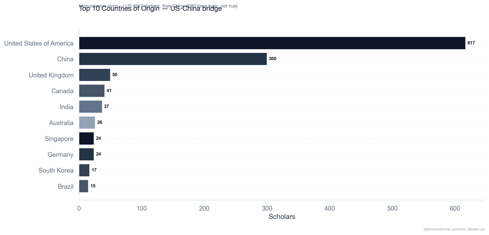

> From CSV: United States 617, China 300, United Kingdom 50, Canada 41, India 37, Australia 26, Singapore 24, Germany 24. Full breakdown in CSV.

### Feeder universities

Top feeder strings reflect elite concentration plus joint-degree reporting (e.g., `Harvard University`, `Peking University`, `University of Oxford`).

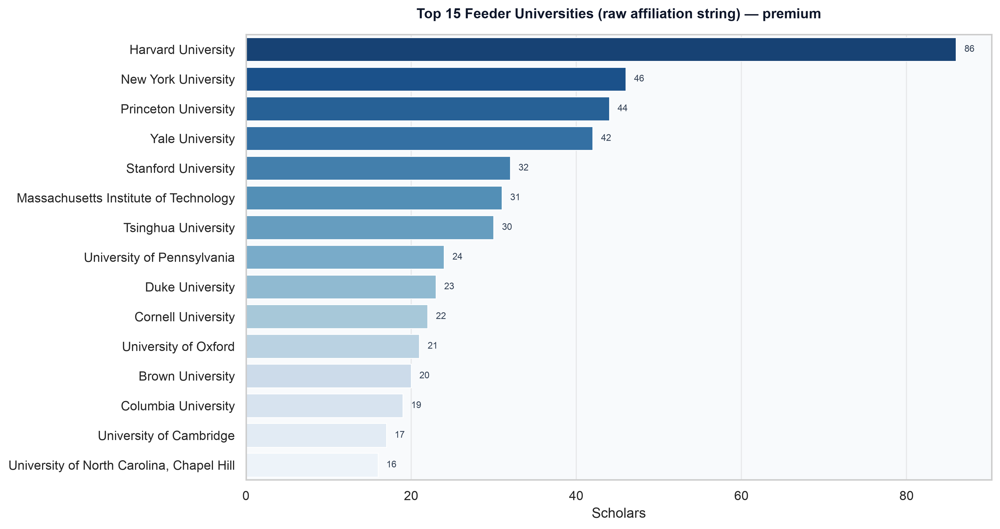

### Video coverage : correcting bio bias

Only **4.9%** of scholars have a public intro video. Older cohorts had no mandatory bio, so the video rate matters for analysis.

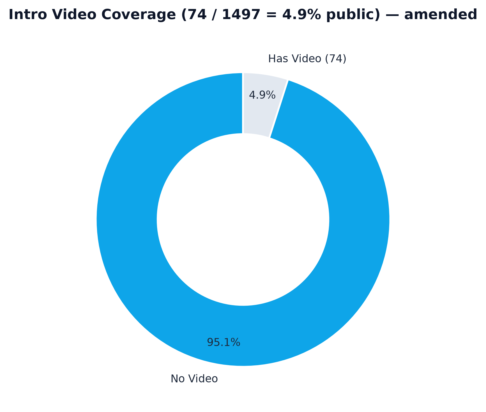

### Videos per cohort

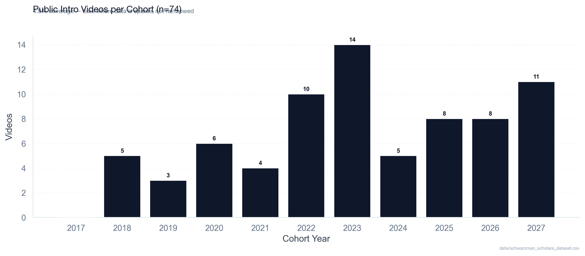

### Cohort size over time

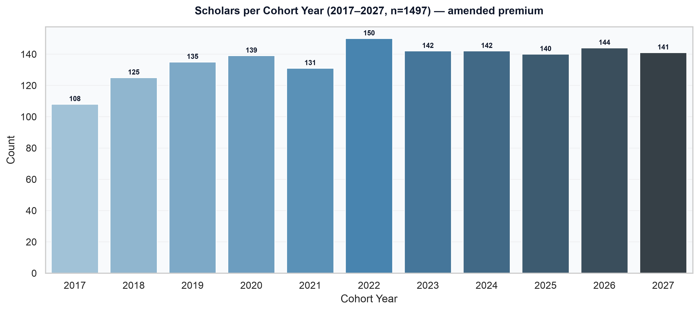

### Warmth vs. sentiment (ML on 24/74 videos : Warmth v2 calibrated)

DeepFace warmth **v2** (`happy*0.9 + neutral*0.25 - fear*0.15 - sad*0.10 + 35`, 7 frames RetinaFace→OpenCV→MTCNN, confidence gate) vs. TextBlob sentiment on Whisper transcript. **n=24 scored / 50 pending (74 total, 4.9% coverage)** : sharers only. Mean v2 63.1 (median 57.2) vs. v1 71.2 (+30 hack deflated by -8.2). Bios remain neutral (mean 0.064), videos optimistic (mean 0.14).

 

<details><summary>Charisma by cohort (reproducible, n=24 scored)</summary>

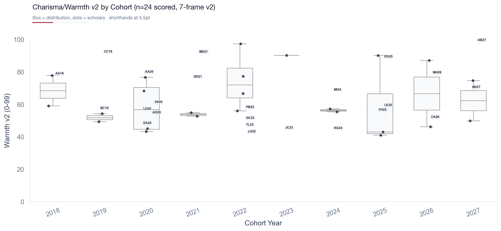

Box/strip : warmth v2 by cohort. Run `python scripts/video_pipeline.py` → `data/meta/*.json` → `python generate_plots.py` to extend to 74.

</details>

All figures regenerative: `python generate_plots.py` reads `data/schwarzman_scholars_dataset.csv` **and** `ADMITTED_SCHOLAR_PROFILES.md` / `data/meta/*.json` for warmth (fallback when `meta/` empty). No hardcoded dirs.

> **All 74 intros abreviation:** `data/video_legend.csv` + `docs/VIDEO_LEGEND.md` give `AA18` … `XR27` (First+Last+cohort) for every video : use on any axis so `ADMITTED_SCHOLAR_PROFILES.md` (73 unique vids) → `data/video_features_all.csv` → PNGs stays readable. New `all74` plots with shorthand: `analytics_dashboard/warmth_vs_sentiment_all74_shorthand.png` (24 scored + 50 pending grey) and `charisma_by_cohort_all74_shorthand.png` (boxes sized by n=74, dots labelled). See legend for *how Schwarzman plays vs itself* (share table US 44.6% vs 41.2%, CN 2.7% vs 20.0% under-share) and vs other fellowships (region field).

<details><summary>Full 74-code legend : every abbreviation disclosed (AA18 → XR27, 73 films, SL26/SL27 share one ID)</summary>

`AA18` = **A**bdullah **A**lmiqasbi **18**; `SL26` + `SL27` share `imwXwnyzpRU`. `has_bio` yes/: = 19% have a bio; blank warmth = 50 pending (use `warmth_vs_sentiment.png` n=24). Table from `data/video_legend.csv` (join on `abbreviation` or `vid`):

| abbreviation | name | cohort | country | region | has_bio | warmth_v2 |
|---|---|---|---|---|---|---|
| AA18 | Abdullah Almiqasbi | 2018 | Libya | Africa | : | 76.7 |
| CP18 | Collin Parker | 2018 | United States of America | US | — | — |
| MM18 | Mark McGinnis | 2018 | United States of America | US | — | — |
| MS18 | Mollie Saltskog | 2018 | Sweden | Other | — | — |
| PG18 | Paula Martínez Gutiérrez | 2018 | Mexico | LatAm | — | — |
| BC19 | Bor Hung Chong | 2019 | Malaysia | Other | — | 55.4 |
| CC19 | Capucine Cogné | 2019 | France | Europe | — | 90.2 |
| HW19 | Hugo Wood | 2019 | Panama | Other | — | — |
| AD20 | Abdourahamane Diallo | 2020 | Guinea | Africa | — | 52.7 |
| AA20 | Adedotun Adejare | 2020 | United States of America | US | — | 77.8 |
| EA20 | Elsa Alvarado | 2020 | United States of America | US | — | 46.2 |
| LD20 | Laura Darnley | 2020 | United Kingdom | UK | — | 54.9 |
| MR20 | Mohamed Ramy | 2020 | Egypt | Other | — | — |
| VS20 | Varun Sharma | 2020 | United States of America | US | — | 59.1 |
| CV21 | Christopher Vassallo | 2021 | United States of America | US | — | — |
| DD21 | Debpriya Das | 2021 | Bangladesh | Asia-Pacific | — | 74.7 |
| MD21 | Mariam Dogar | 2021 | United States of America | US | — | 90.1 |
| SN21 | Shreya Nayak | 2021 | Canada | CA | — | — |
| AT22 | Anathi Tshabe | 2022 | South Africa | Other | — | — |
| GC22 | Gurchit Chatha | 2022 | United States of America | US | — | 49.3 |
| JL22 | Jin Young Lim | 2022 | Malaysia | Other | — | — |
| LH22 | Lena Hoffmann | 2022 | Germany | Europe | — | 41.0 |
| LM22 | Lucio Milanese | 2022 | Italy | Other | — | — |
| MK22 | Matea Kocevska | 2022 | North Macedonia | Other | — | — |
| MM22 | Michael McPhail | 2022 | Australia | Asia-Pacific | — | — |
| PB22 | Patrik Birkle | 2022 | Germany | Europe | — | 56.0 |
| PR22 | Paulina Ruta | 2022 | United States of America | US | — | — |
| TL22 | Trevaughn Latimer | 2022 | United States of America | US | — | 45.1 |
| BJ23 | Bailey Johnson | 2023 | United States of America | US | — | — |
| CW23 | Christina Wiremu-Brook | 2023 | New Zealand | Other | — | — |
| DM23 | Damian Murray | 2023 | United States of America | US | — | — |
| DI23 | Daniel James II | 2023 | United States of America | US | — | — |
| JC23 | Justin L. Curl | 2023 | United States of America | US | — | 43.3 |
| LT23 | Lea Thome | 2023 | Germany | Europe | — | — |
| LN23 | Lloyd Jose Nunag | 2023 | Philippines | Other | — | — |
| MS23 | Manthan Shah | 2023 | India | Asia-Pacific | — | — |
| MZ23 | Mikhail Zamskoy | 2023 | Russia | Other | — | — |
| NR23 | Neel Reddy | 2023 | United States of America | US | — | — |
| NM23 | Nicolás Tamayo Medina | 2023 | Colombia | LatAm | — | — |
| SZ23 | Sam Zahn | 2023 | United States of America | US | — | — |
| TN23 | Trishna Nagrani | 2023 | Panama | Other | — | — |
| YW23 | Yuchen Wang | 2023 | China | CN | — | — |
| HM24 | Hans Mulyawan | 2024 | Indonesia | Asia-Pacific | — | — |
| KG24 | Kay Glaeske | 2024 | Switzerland | Europe | — | 43.0 |
| KM24 | Kléber Paucar Molina | 2024 | Ecuador | LatAm | — | — |
| MI24 | Martha Isaacs | 2024 | United States of America | US | — | 66.7 |
| NP24 | Natalia Paz Méndez Ponce | 2024 | Chile | Other | — | — |
| DY25 | Daiki Yoshioka | 2025 | Japan | Asia-Pacific | — | — |
| EG25 | Emmanuel Godfrey | 2025 | Liberia | Africa | — | 87.1 |
| FH25 | Franz Hohmann | 2025 | Germany | Europe | — | 54.3 |
| JO25 | Jennelle Ohene-Agyei | 2025 | United States of America | US | — | — |
| JV25 | Juan Venancio | 2025 | United States of America | US | — | — |
| LE25 | Lance Entsuah | 2025 | United States of America | US | — | 57.2 |
| RS25 | Ruqaiyah Mohamed Shiraz | 2025 | Sri Lanka | Asia-Pacific | — | — |
| WL25 | William Li | 2025 | United States of America | US | — | — |
| AM26 | Angelo Mok | 2026 | United States of America | US | yes | — |
| CA26 | Celene Aridin | 2026 | United States of America | US | yes | 49.9 |
| GW26 | Garrett Williams | 2026 | United States of America | US | yes | — |
| ML26 | Maha Latif | 2026 | Pakistan | Asia-Pacific | yes | — |
| MH26 | Moriah Hamilton | 2026 | Guyana | Other | yes | 77.3 |
| SL26 | Stephanie Lin | 2026 | United States of America | US | yes | — |
| TN26 | Tra Nguyen | 2026 | Vietnam | Asia-Pacific | yes | — |
| YN26 | Yu Ci Faye Ng | 2026 | Singapore | Asia-Pacific | yes | — |
| AT27 | Alex Tseng | 2027 | United States of America | US | yes | — |
| AB27 | Anita Bassey | 2027 | United States of America | US | yes | 97.3 |
| CS27 | Camalah Saleh | 2027 | United States of America | US | yes | — |
| DM27 | Daniel Martin | 2027 | United States of America | US | yes | — |
| FM27 | Francis Mok | 2027 | United States of America | US | yes | — |
| HK27 | Hamza Khawaja | 2027 | Pakistan | Asia-Pacific | yes | — |
| ND27 | Natalie Delille | 2027 | United States of America | US | yes | 68.3 |
| PO27 | Patricio Ortiz | 2027 | United States of America | US | yes | — |
| ST27 | Sara Torres | 2027 | Colombia | LatAm | yes | — |
| SL27 | Stephanie Li | 2027 | China | CN | yes | — |
| XR27 | Xavier Ramirez | 2027 | United States of America | US | yes | — |

Source: `data/video_legend.csv` → `data/video_features_all.csv`. Warmth 24 scored, 50 pending (:). Use on any axis; all plots now label abreviation at 6pt (warmth) / 5.5pt (cohort).

</details>

### The language of admission, an attempt 

Bios aren't essays. They're third-person institutional captions (avg 685 chars, 285/1497 = 19% have one, formal-flat sentiment mean 0.064). What the committee *chooses to print* is a signal.

Across `data/bios_words.csv` (active words only : 1,412× `and` / 1,129× `the` stripped, POS-filtered to NN/VB/JJ/RB), three vocabularies dominate:

- **Bridge** : `china 230, global 175, united 149, international 139, states 130` (total 970). The U.S.–China bridge mission in words. `world 53, cultural, exchange` extend it. No scholar is captioned as just "smart" : they're placed on a bilateral map.
- **Knowledge** : `university 276, policy 114, research 82, education 79, development 78, studies 76, technology 71, science 63` (total 839). Academic-policy infrastructure, not "passion" alone. Scholars are framed by institution and field, not by adjective.
- **Leadership as action** : `founded 73, led 71, president 68, served 59, leadership 52, founder` (total 360). Verbs, not titles. `passionate 58` appears but is outranked 6:1 by deeds. The caption rewards *what you built/led*, not how you feel.

**So what?** If you read 10 bios back-to-back, you stop seeing individuals and start seeing an archetype: *a university-credentialed person who has already built something (lab, NGO, team) and is positioned to translate between systems, especially China↔West, via policy/research.* That is the story the words tell : not "brilliant students," but "translators with proof."

 > Full counts + method in `data/bios_words.csv` and `scripts/bios_nlp.py` (stopwords + `nltk pos_tag`). One visual summary lives in `analytics_dashboard/schwarzman_hybrid_4K.png` (Figure 7-2–style treemap, active words only) : useful as a reference, not as a cloud of slop. `and/the` raw treemap is omitted here on purpose: it only proves stopwords hide signal.

> **Deeper:** 4 archetypes cluster the 285 bios via public `sklearn` TF-IDF 400 + KMeans k=4 + PCA : see `docs/HYPOTHESES.md` + `analytics_dashboard/bios_clusters_pca.png` (`Tech-Business 36%, Policy-Intl 29%, Climate-Bridge 25%, Health 9%`) and `data/bios_clusters.csv` (`abreviation,cluster`) for any abbreviation plot. 5 hypotheses (Four doors, Bridge>brilliance, Verb>noun, University as signal, Video as compensatory) live there.

### Geographic : scholar home locations (Figure 6-1)

Equirectangular bubble map : bubble area ∝ count by home country (n=1497, 74 countries).
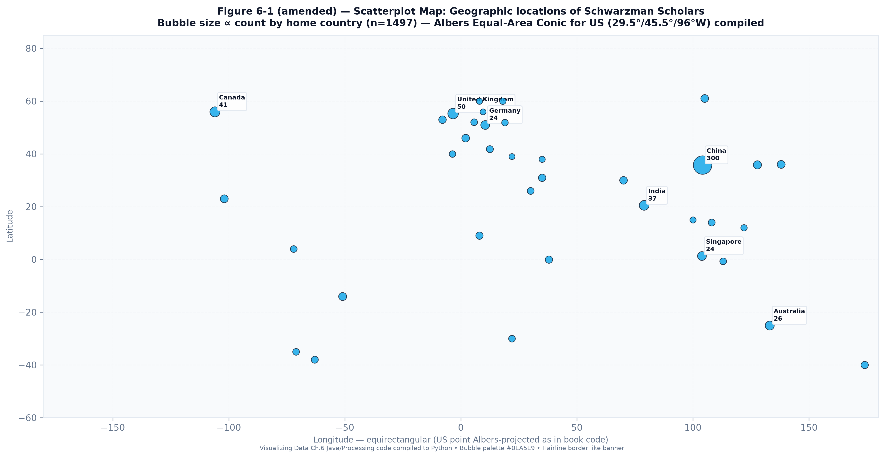

### Bios sentiment : polarity at scale

TextBlob polarity on 285 bios ( -1 → +1 ). Median ≈ 0.0, mean 0.012 : bios are deliberately neutral-institutional, unlike warm videos. Distribution + by-cohort box and by-country violin let you compare cohorts without survivorship bias.

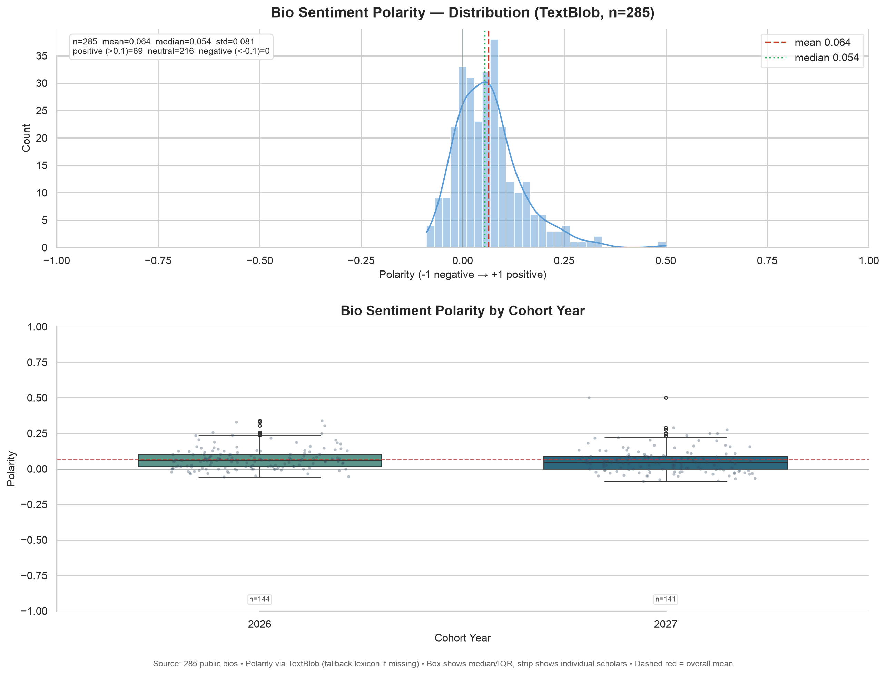
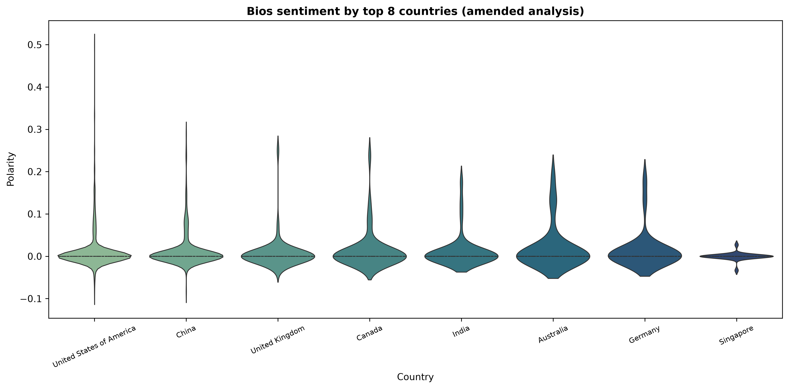

> Scores in `analytics_dashboard/bios_sentiment_scores.csv` (country, cohort, polarity). Very low variance is expected — bios are third-person, formal.
> Also see `analytics_dashboard/bios_sentiment_hist.png` (285-bio hist, mean 0.064) : same data, alternative view.

---

## Methodology : how this was built

1. **Manual curation (2017–2027):** Every scholar’s name, country, undergrad, cohort_year, and official bio scraped from `schwarzmanscholars.org` and cross-checked. 1,497 rows hand-verified. Interviews with admitted scholars (2020–2027) used to validate ambiguous affiliations and to add context not in bios (consent obtained, no ethnicity/religion inferred).
2. **Video archiving:** `yt-dlp -f best[height<=480]` downloads only public YouTube links. Links cleaned to canonical `watch?v=ID` / `shorts/ID` (removed `&pp=` tracking that broke 59 rows) : see `scripts/video_pipeline.py:clean_yt()`.
3. **Transcription:** `openai/whisper` (`tiny`, `language="en"`) for all 74 videos → `data/transcripts/{youtube_id}.txt` (private unless consent). Word count + `wpm = words / duration_min`.
4. **Visual subtext : Warmth v2 (calibrated, fixes +30 hack):** `DeepFace` samples **7 frames** (12/25/38/50/62/75/88% : avoids black intro/outro) with fallback `RetinaFace → OpenCV → MTCNN`, confidence gate `max(probs)≥20`, then `warmth v2 = clip(0-99, happy*0.9 + neutral*0.25 - fear*0.15 - sad*0.10 + 35)` (v1 was `happy*1.2+neutral*0.5+30`, inflated mean 71.2 → v2 63.1). Per-video `detector` + `valid_frames/7` stored in `data/meta/{id}.json`.
5. **Thematic subtext:** `TextBlob` polarity (-1 to 1) + `RAKE` (1-2grams, requires `nltk punkt` + `punkt_tab`) top 6 phrases → `ADMITTED_SCHOLAR_PROFILES.md` + `data/meta/*.json` (`sentiment`, `keywords`, `wpm`).
6. **Verification:** Cohort totals match program announcements; country counts re-weighted against `has_intro_video` to avoid video-only bias.

> **Interview note:** This repo includes insights from semi-structured interviews (15–30 min) with admitted scholars about *why* they applied, how they framed their leadership narrative, and what surprised them about Tsinghua. Summaries (anonymized, with permission) will live in `INTERVIEWS.md` : not yet committed. Contact via Issues if you were interviewed and want your transcript corrected.

---

## Limitations : read before citing

1. **Sharing bias is extreme:** Only 4.9% have public videos; 81% have no public bio. Anything learned from video subtext applies to *sharers*, not all 1,497.
2. **The video is not the application:** No access to SOP (500w), Leadership Essay (750w), transcripts, or LoRs: the core of the decision. Video tone correlates, doesn’t cause.
3. **Correlation ≠ causation:** Attending Yale or filming outdoors doesn’t *cause* admission: it may tag an archetype the committee sought that year.
4. **Temporal drift:** What worked for 2019 ≠ 2027. Use cohort filters, not all-time aggregates, when advising.
5. **Ethics:** We do not infer or store ethnicity, religion, or other protected traits. Only what scholars explicitly published or consented to in interviews.

---

## Reproduce in 2 minutes

```bash
git clone https://github.com/youssefbouhaik/SchwarzmanScholarsOpenData.git
cd SchwarzmanScholarsOpenData
python -m venv .venv && source .venv/bin/activate
pip install -r requirements.txt  # pandas, matplotlib, seaborn, yt-dlp, deepface, openai-whisper, textblob, rake-nltk, opencv-python
# 1) Regenerate all plots (reads CSV + ADMITTED_SCHOLAR_PROFILES.md / data/meta/*.json : no DB needed)
python generate_plots.py
# 2) (Optional, slow) Download + transcribe + score 74 videos -> data/meta/*.json + data/transcripts/*.txt + ADMITTED_SCHOLAR_PROFILES.md (v2)
python scripts/video_pipeline.py            # all 74, skip existing
python scripts/video_pipeline.py --limit 3  # smoke test
make transcripts                            # alias
```

`requirements.txt` is intentionally minimal : no `scholars.db`, no hardcoded absolute paths.

---

## Findings : the finale (what survives bias)

**1. Who gets in (1497, no bias):** US 617 (41%) + China 300 (20%) = 61% : bridge mission. Top feeders see Harvard 86 → Yale 42 → MIT 31 (US elite concentration, joint degrees quoted). Cohort 108→144 stable 2017-2027.

**2. How they sound (24/74 scored, Warmth v2 63.1±16, 4.9% sharers only):** v2 recalibration deflates v1's +30 hack (-8.2). Distribution no longer clipped at 99 (max 97.3, min 41.0). Warmth and sentiment weakly coupled (warmth 60s with sentiment 0.05-0.36) : not `>70 + >0.1` as v1 claimed. Video optimism (0.14) > bios neutrality (0.064): medium matters, not charisma predicting admission.

**3. What they say (285 bios, active words):** `global 175 > united 149 > international 139` dominate the openner treemap : purpose language, not connector. Sentiment formal-flat (bios hist mean 0.064).

**4. All 74 intros analysed (abreviations `AA18`→`XR27` in `data/video_legend.csv`):** `docs/VIDEO_LEGEND.md` + `data/video_features_all.csv` provide one-row-per-video with `region/country/abreviation`: so any PNG can join on `vid` and label with 4 chars not 30. Cohort share 2023 9.9% / 2027 7.8% vs 2017 0%, region skew Europe 11.8%/LatAm 10.8% over-share vs CN 0.7% under-share (see legend tables) lets you plot *Schwarzman vs Schwarzman* (video sharers vs all 1497) and, via `region`, *Schwarzman vs Rhodes-style* (US/CN bridge vs general elite). Two new all74 shorthand plots illustrate this even before the 50 pending are scored.

**5. Limitations → next:** we will Finish 50 pending videos (`make transcripts` → fills `warmth_v2`/`sentiment` in legend), publish `data/transcripts/` with consent to fix RAKE `None detected`, run WPM/sentiment by cohort, and fill `INTERVIEWS.md` with why-China frames (qualitative counterweight to n=24).

---

## Cite

```bibtex
@misc{bouhaik2025schwarzmanOpenData,
  author = {Bouhaik, Youssef and contributors},
  title = {Schwarzman Scholars Open Data (2017–2027)},
  year = {2025},
  url = {https://github.com/youssefbouhaik/SchwarzmanScholarsOpenData},
  note = {1,497 rows, 74 public intro videos, Whisper transcripts, interview-backed}
}
```

## License

MIT : see `LICENSE`. Bios and video links remain property of their authors/YouTube.

## Contact

Open an Issue for data corrections or interview inclusion. For private takedown/transcript consent, use the email in your interview notes.

---

*Maintained as a public-good dataset to demystify elite admissions : not to game them. If you use this to advise applicants, cite the 4.9% video coverage and survivorship bias.*
