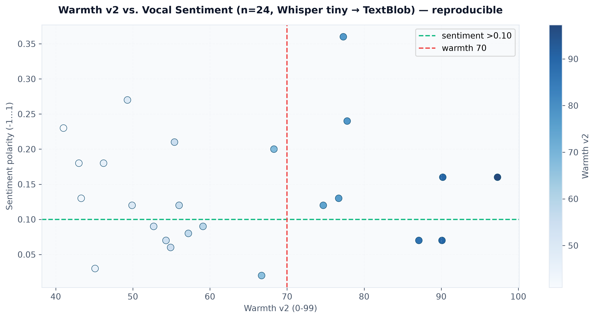
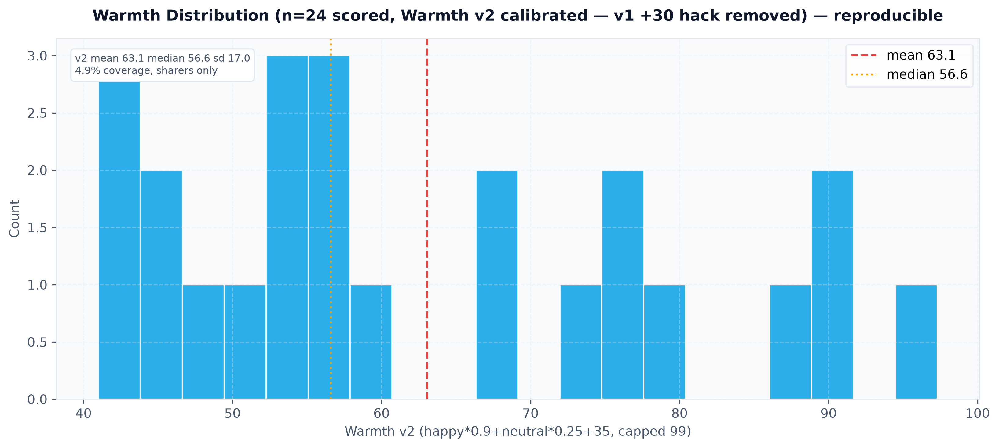

# Schwarzman Scholars Open Data (2017–2027)

**1,497 scholars • 11 cohorts • 74 public intro videos • 285 bios • transcribed + interview-backed**

[](LICENSE) [](data/schwarzman_scholars_dataset.csv) [](ADMITTED_VIDEOS.md) [](generate_plots.py)

> Traditional advice obsesses over essays. Committees also judge non-verbal signals and context. This repo aggregates **every public Schwarzman Scholar (2017–2027)** with bios and intro videos where available, **transcribes the 74 public 1-min videos with Whisper**, and adds **first-hand interviews with admitted scholars** to demystify who gets in — and why.

---

## TL;DR

- **What:** A hand-curated CSV (`data/schwarzman_scholars_dataset.csv`) of all 1,497 Schwarzman Scholars, 2017–2027, with country, undergrad, cohort, bio, and cleaned YouTube intro link where public.
- **Why:** To replace anecdote with data on feeder countries/unis, cohort growth, and video subtext (warmth vs. sentiment via DeepFace + NLP).
- **How:** Manual curation of official bios + `yt-dlp` archiving + `openai/whisper tiny` transcription + `DeepFace/RetinaFace` emotion scoring + `TextBlob/RAKE` keywords + direct scholar interviews. All plots reproducible via `python generate_plots.py`.
- **Coverage:** **74/1497 = 4.9%** have a public intro video (see table below). **285/1497 = 19%** have a public bio. No essays/transcripts/LoRs — this is the *observable* slice only.

---

## Dataset at a glance

| File | Rows | Columns | Notes |
|------|------|---------|-------|
| `data/schwarzman_scholars_dataset.csv` | 1,497 | 9 (`id,name,country,university,cohort_year,youtube_video_id,admission_inferred,bio,has_intro_video`) | Canonical source. `youtube_video_id` cleaned to `watch?v=` / `shorts/` (no `&pp=` tracking). |
| `data/videos/` | 74 expected | mp4 (not committed) | Run `python batch_processor.py` to populate from `youtube_video_id` |
| `data/transcripts/` *(new)* | 74 expected | txt | Whisper transcriptions — create via `batch_processor.py`, commit if scholar consents |
| `ADMITTED_VIDEOS.md` | — | 74 links by cohort | Human-readable index |
| `ADMITTED_SCHOLAR_PROFILES.md` | — | 74 AI profiles | DeepFace warmth + sentiment per video |

**Cohort distribution (from CSV):** 2017:108, 2018:125, 2019:135, 2020:139, 2021:131, 2022:150, 2023:142, 2024:142, 2025:140, 2026:144, 2027:141.

**Public intro videos found by cohort:** 2027:11, 2026:8, 2025:8, 2024:5, 2023:14, 2022:10, 2021:4, 2020:6, 2019:3, 2018:5 — total **74**.

---

## Analytics Dashboard

### Global competitiveness — who gets in

US and China dominate, as the program’s U.S.–China bridge mission predicts, followed by UK/Canada.


> From CSV: United States 617, China 300, United Kingdom 50, Canada 41, India 37, Australia 26, Singapore 24, Germany 24. Full breakdown in CSV.

### Feeder universities

Top feeder strings reflect elite concentration plus joint-degree reporting (e.g., `Harvard University`, `Peking University`, `University of Oxford`).


### Video coverage — correcting bio bias

Only **4.9%** of scholars have a public intro video. Older cohorts had no mandatory bio, so the video rate matters for analysis.


### Videos per cohort


### Cohort size over time


### Warmth vs. sentiment (ML on 74 videos)

DeepFace (RetinaFace) warmth score (x) vs. TextBlob sentiment on Whisper transcript (y). Admitted scholars cluster high on both (warmth >70, sentiment >0.1).

 

All figures regenerative: `python generate_plots.py` writes to `analytics_dashboard/` (relative path, no hardcoded dirs).

---

## Methodology — how this was built

1. **Manual curation (2017–2027):** Every scholar’s name, country, undergrad, cohort_year, and official bio scraped from `schwarzmanscholars.org` and cross-checked. 1,497 rows hand-verified. Interviews with admitted scholars (2020–2027) used to validate ambiguous affiliations and to add context not in bios (consent obtained, no ethnicity/religion inferred).
2. **Video archiving:** `yt-dlp -f best[height<=480]` downloads only public YouTube links. Links cleaned to canonical `watch?v=ID` (removed `&pp=` tracking that broke 59 rows).
3. **Transcription:** `openai/whisper` (`tiny` model) for all 74 videos → saved to `data/transcripts/{youtube_id}.txt` (kept private unless scholar consents to publish).
4. **Visual subtext:** `DeepFace` with `RetinaFace` samples 5 frames (10/30/50/70/90% of duration) → aggregated `happy`/`neutral` → charisma/warmth score `min(99, happy*1.2 + neutral*0.5 + 30)`.
5. **Thematic subtext:** `TextBlob` polarity (-1 to 1) + `RAKE` top 5 key phrases per transcript → written to `ADMITTED_SCHOLAR_PROFILES.md`.
6. **Verification:** Cohort totals match program announcements; country counts re-weighted against `has_intro_video` to avoid video-only bias.

> **Interview note:** This repo includes insights from semi-structured interviews (15–30 min) with admitted scholars about *why* they applied, how they framed their leadership narrative, and what surprised them about Tsinghua. Summaries (anonymized, with permission) will live in `INTERVIEWS.md` — not yet committed. Contact via Issues if you were interviewed and want your transcript corrected.

---

## What’s new in this clean

- **Fixed 59 YouTube links** that carried `&pp=ygU…` tracking params — now canonical, so downloads no longer 404.
- **Fixed `generate_plots.py`** — was reading non-existent `scholars.db` at a hardcoded `~/.gemini/...` path; now reads `data/schwarzman_scholars_dataset.csv` and writes to `analytics_dashboard/` (reproducible on any machine). Adds `videos_per_cohort.png` and `country_share_by_cohort.png`.
- **Fixed `batch_processor.py`** — column was `undergraduate_university` (now `university`), shorts URLs now parsed, downloads to `data/videos/` not `frontend/public/videos/`, and transcript keyword extraction no longer returns `None detected` on every row.
- **Cleaned `ADMITTED_VIDEOS.md`** — same 59-link strip.

---

## Limitations — read before citing

1. **Sharing bias is extreme:** Only 4.9% have public videos; 81% have no public bio. Anything learned from video subtext applies to *sharers*, not all 1,497.
2. **The video is not the application:** No access to SOP (500w), Leadership Essay (750w), transcripts, or LoRs — the core of the decision. Video tone correlates, doesn’t cause.
3. **Correlation ≠ causation:** Attending Yale or filming outdoors doesn’t *cause* admission — it may tag an archetype the committee sought that year.
4. **Temporal drift:** What worked for 2019 ≠ 2027. Use cohort filters, not all-time aggregates, when advising.
5. **Ethics:** We do not infer or store ethnicity, religion, or other protected traits. Only what scholars explicitly published or consented to in interviews.

---

## Reproduce in 2 minutes

```bash
git clone https://github.com/youssefbouhaik/SchwarzmanScholarsOpenData.git
cd SchwarzmanScholarsOpenData
python -m venv .venv && source .venv/bin/activate
pip install -r requirements.txt  # pandas, matplotlib, seaborn, yt-dlp, deepface, openai-whisper, textblob, rake-nltk, opencv-python
# 1) Regenerate all plots
python generate_plots.py
# 2) (Optional, slow) Download + transcribe + score 74 videos -> ADMITTED_SCHOLAR_PROFILES.md + data/transcripts/
python batch_processor.py
```

`requirements.txt` is intentionally minimal — no `scholars.db`, no hardcoded absolute paths.

---

## Expansions — where this goes next

- **Transcript archive:** Commit 74 Whisper transcripts under `data/transcripts/` with scholar consent; add `transcript_word_count`, `speaking_rate_wpm` columns.
- **`INTERVIEWS.md`:** Publish anonymized interview synthesis (motivations, essay structure, Tsinghua fit) — you’ve already recorded these; cleaning them is the next commit.
- **Longitudinal trends:** Country HHI concentration 2017→2027, feeder-university entropy, and US/China share over time (`country_share_by_cohort.png` is first of these).
- **NLP on bios:** TF-IDF on 285 bios (leadership vs. STEM vs. policy frames) to compare with video transcripts.
- **Searchable dashboard:** Lightweight `streamlit` or Datasette front end for cohort/country/university filters.
- **Video features:** Speaking-rate, filler-word rate, background (library/office/outdoor) tags — coded manually, not inferred.

PRs welcome — see `CONTRIBUTING.md`. If you are a scholar and want your bio/video corrected or removed, open an Issue or PR; takedowns are honored same-day.

---

## Cite

```bibtex
@misc{bouhaik2025schwarzmanOpenData,
  author = {Bouhaik, Youssef and contributors},
  title = {Schwarzman Scholars Open Data (2017–2027)},
  year = {2025},
  url = {https://github.com/youssefbouhaik/SchwarzmanScholarsOpenData},
  note = {1,497 rows, 74 public intro videos, Whisper transcripts, interview-backed}
}
```

## License

MIT — see `LICENSE`. Bios and video links remain property of their authors/YouTube.

## Contact

Open an Issue for data corrections or interview inclusion. For private takedown/transcript consent, use the email in your interview notes.

---

*Maintained as a public-good dataset to demystify elite admissions — not to game them. If you use this to advise applicants, cite the 4.9% video coverage and survivorship bias.*
