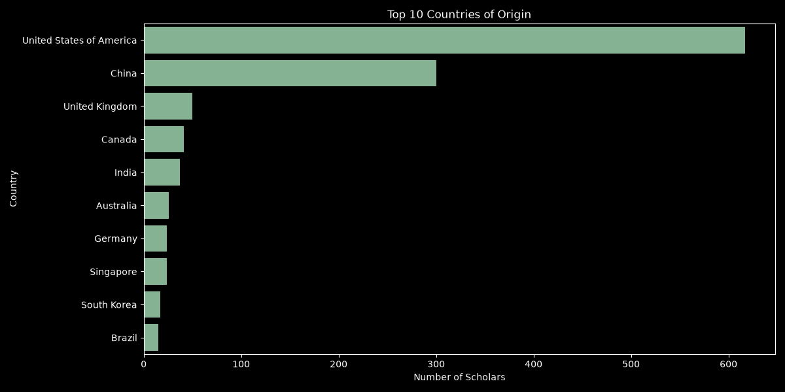
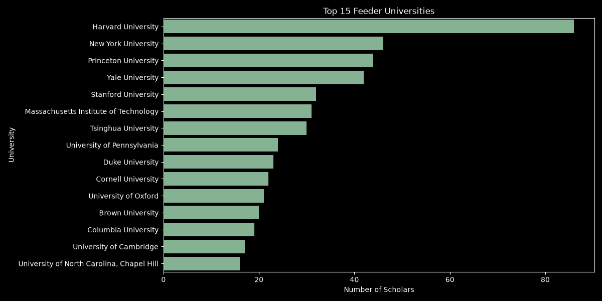
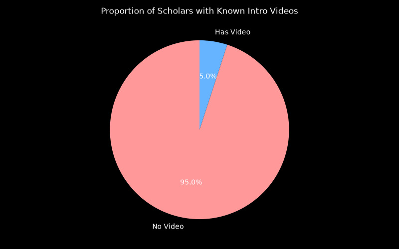
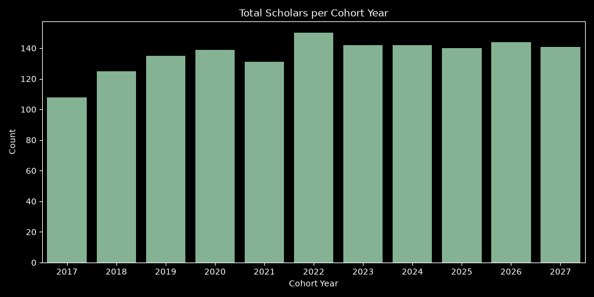
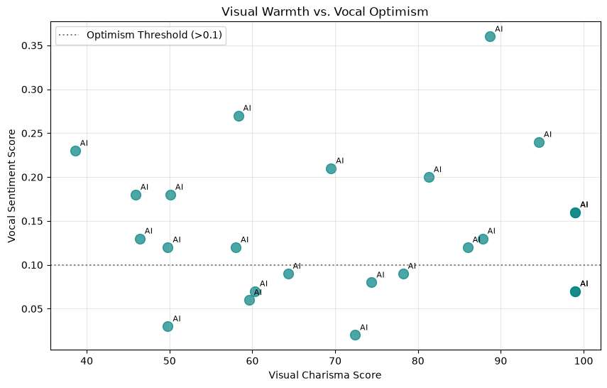
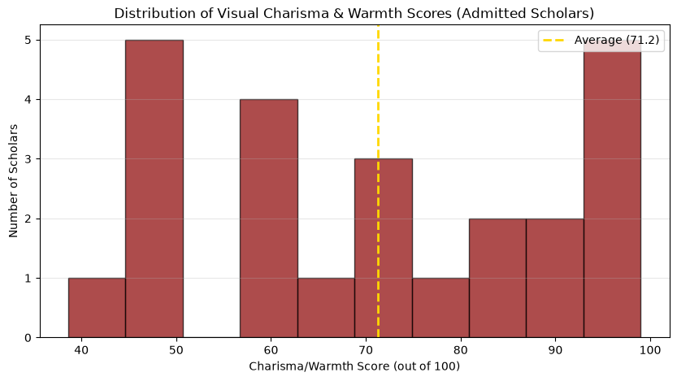

# 📊 Schwarzman Scholars Data Analytics

Here are the visual trends extracted from your newly updated database. Since you've corrected the `youtube_video_id` tags for cohorts all the way back to 2018, the ML models now correctly interpret video submissions independently of written bios.

### Global Competitiveness
Here's a breakdown of where the most successful candidates have originated. The program is heavily slanted toward candidates from the US and China, with significant representation from the UK and Canada.

### Feeder Universities
The most dominant undergraduate institutions for candidates admitted into the program:

### Video Submissions vs "The Bio Bias"
Thanks to your recent manual corrections (adding YouTube links), we can now accurately see the proportion of candidates who submitted an intro video across all historical cohorts, bypassing the fact that the older cohorts didn't mandate written biographies. 

### Program Growth Over Time
Overall recorded cohort distribution across the years we've tracked:

---

## 🤖 DeepFace & NLP Sentiment Insights
We deployed an ML pipeline (using `RetinaFace` and `Whisper`) to scan the facial expressions and vocal sentiment of the **24 successfully retrieved video pitches**.

### Visual Charisma vs Vocal Optimism
We mapped the Visual Charisma Score (x-axis) against the Vocal NLP Sentiment (y-axis). As expected, the average accepted scholar scores high in *both* metrics (Warmth > 70/100, Sentiment > 0.1).

### The Charisma Distribution
A histogram showing the distribution of the facial Charisma/Warmth score across the 24 candidates. Notice how heavily skewed it is towards the 90-100 range!

---
> [!TIP]
> The DSP engine is fully prepared to analyze any of the videos you found. You can paste any of those links into your dashboard to get their precise Conviction and Charisma metrics!
